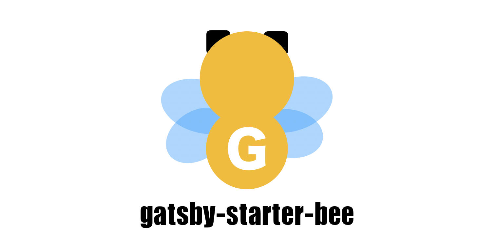
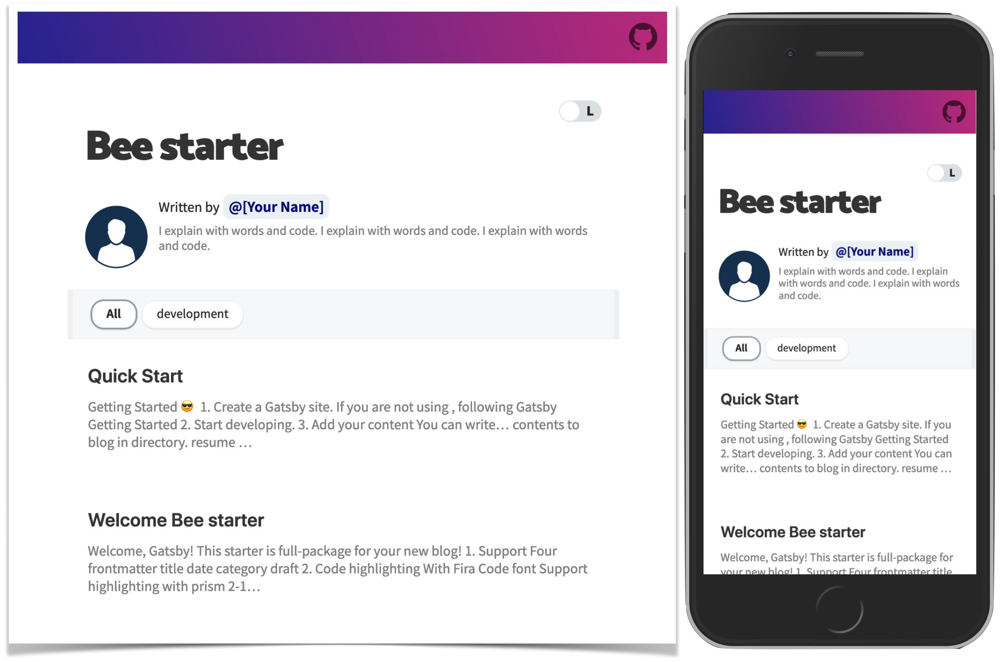

<div align="center">

  

</div>

[](https://opencollective.com/gatsby-starter-bee) [](https://greenkeeper.io/)
[](https://lgtm.com/projects/g/JaeYeopHan/gatsby-starter-bee/alerts/)
[](https://github.com/ebidel/lighthouse-badge)
[](https://github.com/dwyl/esta/issues)
[](https://app.netlify.com/sites/gatsby-starter-bee/deploys)



In this template...

- 💄 Code highlight with Fira Code font
- 🧙 CLI Tool
- 😄 Emoji (emojione)
- 🗣 Social share feature (Twitter, Facebook)
- 💬 Comment feature (disqus, utterances)
- ☕ 'Buy me a coffee' service
- 🤖 GA
- ⭐ Enhance UX
- ⚙ Configurable

> [About this Template](https://www.gatsbyjs.org/starters/JaeYeopHan/gatsby-starter-bee/)

## 😎 Quick Start

### 1. Create a Gatsby site

```sh
# create a new Gatsby site using the blog starter
npx gatsby new my-blog-starter https://github.com/JaeYeopHan/gatsby-starter-bee
```

> If you are not using `npx`, following [Gatsby Getting Started](https://www.gatsbyjs.org/docs/quick-start)

```sh
npm install -g gatsby-cli
gatsby new my-blog-starter https://github.com/JaeYeopHan/gatsby-starter-bee
```

### 2. Start developing

```sh
cd my-blog-starter/
npm start
# open localhost:8000
```

### 3. Add your content

You can write...

- contents to blog in `content/blog` directory.
- resume `content/__about` directory.

> With markdown syntax and some meta data

#### Support script for creating new post


```sh
npm run post
```

👉 Use **gatsby-post-gen** (https://github.com/JaeYeopHan/gatsby-post-gen)

### 4. Fix meta data

You can fix meta data of blog in `/gatsby-meta-config.js` file.

### 5. Publish with [netlify](https://netlify.com)

[](https://app.netlify.com/start/deploy?repository=https://github.com/JaeYeopHab/gatsby-starter-bee)

:bulb: if you want to deploy github pages, add following script to package.json

```json
"scripts": {
    "deploy": "gatsby build && gh-pages -d public -b master -r 'git@github.com:${your github id}/${github page name}.github.io.git'"
}
```

## 🧐 Customize

### ⚙ Gatsby config

```sh
/root
├── gatsby-browser.js // font, polyfill, onClientRender ...
├── gatsby-config.js // Gatsby config
├── gatsby-meta-config.js // Template meta config
└── gatsby-node.js // Gatsby Node config
```

### ⛑ Structure

```sh
src
├── components // Just component with styling
├── layout // home, post layout
├── pages // routing except post: /(home), /about
├── styles
│   ├── code.scss
│   ├── dark-theme.scss
│   ├── light-theme.scss
│   └── variables.scss
└── templates
    ├── blog-post.js
    └── home.js
```

### 🎨 Style

You can customize color in `src/styles` directory.

```sh
src/styles
├── code.scss
├── dark-theme.scss
├── light-theme.scss
└── variables.scss
```

### 🍭 Tips (You can change...)

- Profile image! (replace file in `/content/assets/profile.png`)
- Favicon image! (replace file in `/content/assets/felog.png`)
- Header gradient! (\$theme-gradient `/styles/variables.scss`)
- Utterances repository! (replace repository address in `/gatsby-meta-config.js`)
  - ⚠️ Please check, this guide(https://utteranc.es/)